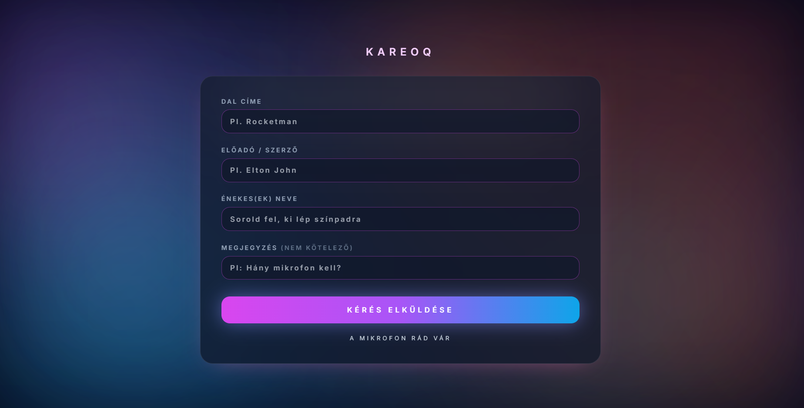
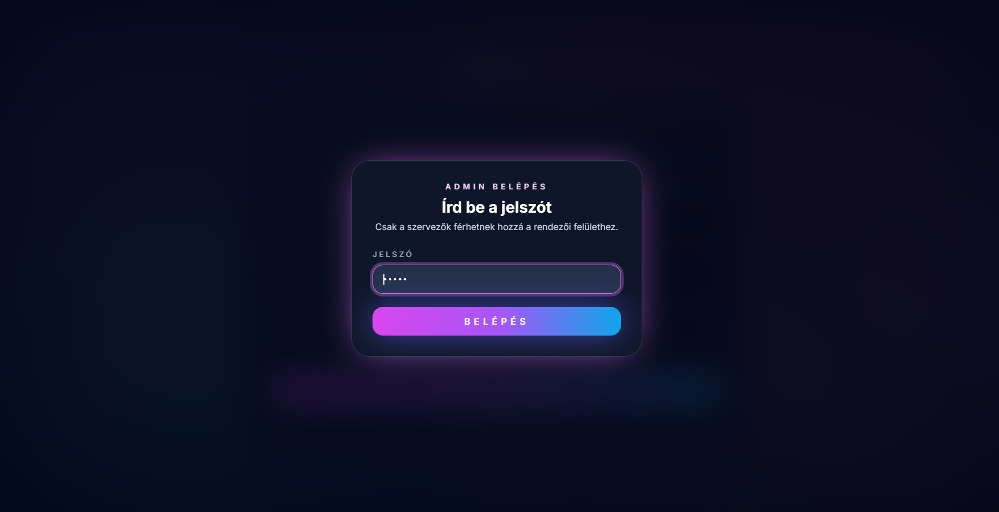
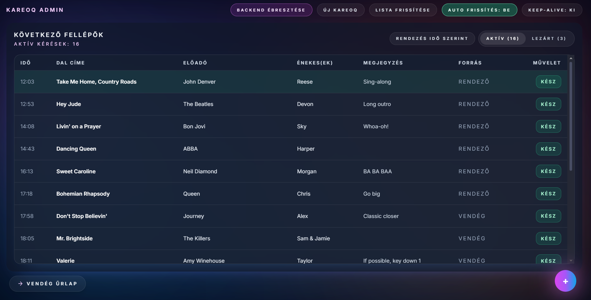

# KareoQ

A modern web app for managing a karaoke request queue: guests submit song requests, organizers manage the live queue from a password-protected admin dashboard.

## Screenshots

### Guest request form



### Admin login



### Admin dashboard



## Features

- **Guest Interface**: Submit karaoke song requests with song title, performer, singers, and optional notes
- **Admin Dashboard**: Password-protected organizer interface to manage the queue
- **IP-based Throttling**: Automatic limit of 2 pending requests per IP address
- **Real-time Queue Management**: Mark songs as played, add organizer requests, or reset the entire queue
- **Health Monitoring**: Backend status tracking with uptime display
- **Toast Notifications**: User-friendly feedback for all actions
- **Responsive Design**: Works seamlessly on mobile and desktop
- **Client-side Validation**: Inline field validation with helpful error messages

## Quick Start

### Prerequisites

- **Node.js** (v16 or higher)
- **Python** (v3.8 or higher)
- **npm** or **yarn**

### Installation

1. **Clone the repository**
   ```bash
   git clone https://github.com/Spyro1/KareoQ.git
   cd KareoQ
   ```

2. **Set up the backend**
   ```bash
   cd backend
   python -m venv venv
   # On Windows:
   .\venv\Scripts\Activate.ps1
   # On Linux/macOS:
   source venv/bin/activate
   
   pip install -r requirements.txt
   cd ..
   ```

3. **Set up the frontend**
   ```bash
   cd frontend
   npm install
   cd ..
   ```

### Running the Application

#### Option 1: Use the automated script (Windows)

```powershell
.\run.ps1
```

This PowerShell script will:
- Start the backend (Uvicorn) in the background on port 8000
- Start the frontend (React dev server) on port 3000
- Automatically clean up both processes when you exit

#### Option 2: Use the bash script (Linux/macOS)

```bash
chmod +x run.sh
./run.sh
```

#### Option 3: Manual startup

**Terminal 1 - Backend:**
```bash
cd backend
# Activate virtual environment
source venv/bin/activate  # Linux/macOS
# or
.\venv\Scripts\Activate.ps1  # Windows

uvicorn app.main:app --reload --host 0.0.0.0 --port 8000
```

**Terminal 2 - Frontend:**
```bash
cd frontend
npm start
```

The application will be available at:
- **Frontend (Guest)**: http://localhost:3000
- **Frontend (Admin)**: http://localhost:3000/#admin
- **Backend API**: http://localhost:8000
- **API Documentation**: http://localhost:8000/docs

## Configuration

Create a `.env` file in the `frontend/` directory:

```env
REACT_APP_BACKEND_URL=http://localhost:8000
REACT_APP_ADMIN_PASSWORD=your_secure_password
```

Notes:
- `REACT_APP_BACKEND_URL` should include the scheme (e.g. `http://`).
- The admin screen is enabled when the URL contains `#admin`.

## Project Structure

```
KareoQ/
├── backend/              # FastAPI backend
│   ├── app/
│   │   ├── __init__.py
│   │   ├── database.py   # Database configuration
│   │   ├── main.py       # API endpoints
│   │   ├── models.py     # SQLModel schemas
│   │   └── app.db        # SQLite database
│   ├── requirements.txt
│   └── README.md
├── frontend/             # React frontend
│   ├── public/
│   ├── src/
│   │   ├── App.tsx
│   │   ├── AdminDashboard.tsx
│   │   ├── AdminRequestTable.tsx
│   │   ├── AdminActionButtons.tsx
│   │   ├── SongRequestForm.tsx
│   │   ├── BackgroundGlow.tsx
│   │   ├── useToast.tsx
│   │   ├── ToastProvider.tsx
│   │   └── adminTypes.ts
│   ├── package.json
│   └── README.md
├── run.ps1              # Windows PowerShell startup script
├── run.sh               # Linux/macOS bash startup script
└── README.md
```

## API Endpoints

- `GET /health` - Health check with uptime
- `GET /requests` - List song requests (query params: `include_played`, `admin`)
- `POST /requests` - Submit a new song request
- `PATCH /requests/{id}/play` - Mark a request as played
- `DELETE /requests` - Reset the queue (delete all requests)

See full API docs at http://localhost:8000/docs when the backend is running.

## Tech Stack

### Frontend
- **React** 19.2 with TypeScript
- **Tailwind CSS** for styling
- **Create React App** build system
- Custom toast notification system
- Client-side form validation

### Backend
- **FastAPI** - Modern Python web framework
- **SQLModel** - SQL database ORM
- **SQLite** - Lightweight database
- **Uvicorn** - ASGI server
- CORS enabled for local development

## Security Features

- IP-based request throttling (max 2 pending per IP)
- Password-protected admin interface
- Admin requests bypass IP limits (flagged with `admin::` prefix)
- Input validation on both client and server

## Deployment

The project includes GitHub Actions workflows for deployment:

- Frontend deploys to GitHub Pages automatically on push to main
- Backend can be deployed to any Python-compatible hosting service (e.g., Railway, Heroku, AWS)

### Building for Production

**Frontend:**
```bash
cd frontend
npm run build
```

**Backend:**
```bash
cd backend
uvicorn app.main:app --host 0.0.0.0 --port 8000
```

## Development Notes

- The SQLite database file is created automatically on first run
- Backend runs with `--reload` flag in development for hot reloading
- Frontend runs on port 3000 by default
- Admin password can be changed via environment variable

## License

This project is licensed under the MIT License - see the LICENSE file for details.
